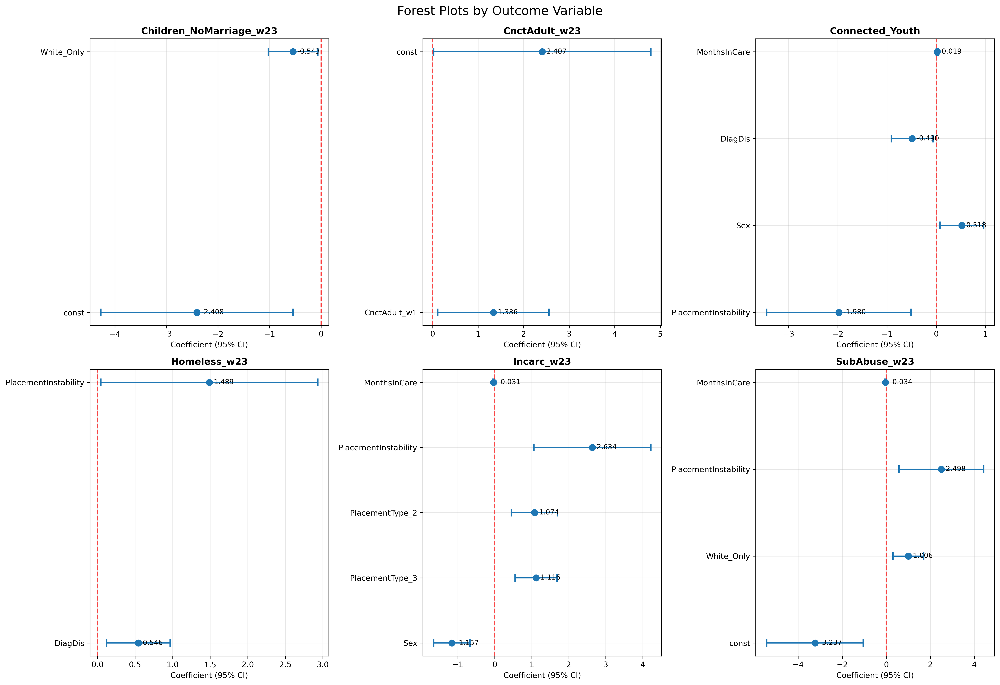
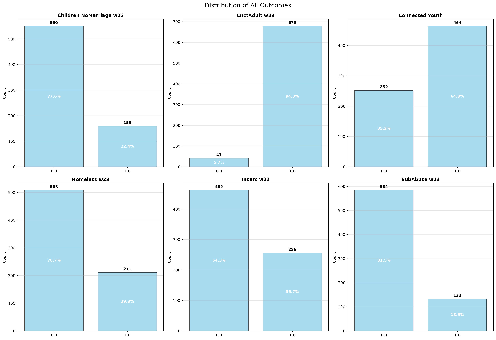
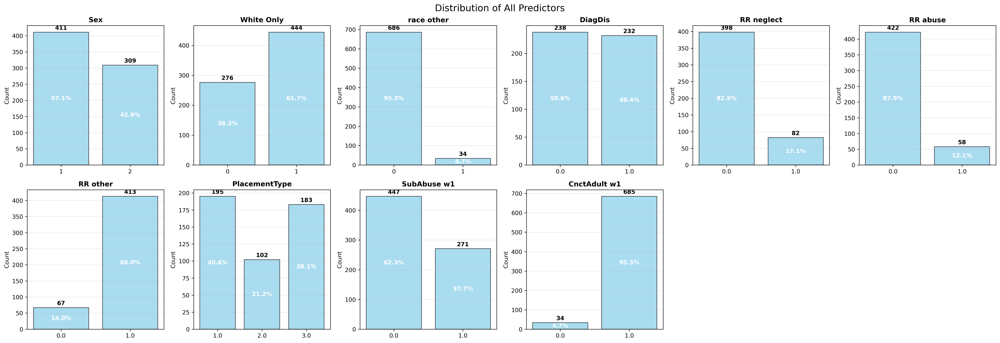

<link rel="stylesheet" href="style.css">

    <a href="#table-of-contents">Return to Table of Contents</a>

    

<h1 class="report-title">NYTD Modeling: Visual Data Report</h1>
<h2 class="report-subtitle">A Statistical Analysis of Foster Care Youth Outcomes in Tennessee</h2>

    

        <h2>📑 Table of Contents</h2>
        <ol>
            <li><a href="#introduction">Introduction</a></li>
            <li><a href="#summary-dashboard">Summary Dashboard</a></li>
            <li><a href="#executive-summary">Executive Summary</a></li>
            <li><a href="#data-curation--methodology">Data Curation & Methodology</a></li>
            <li><a href="#data-overview">Data Overview</a></li>
            <li><a href="#significant-variables-from-paper">Significant Variables</a></li>
            <li><a href="#significant-model-results">Significant Model Results</a></li>
            <li><a href="#descriptive-statistics">Descriptive Statistics</a></li>
            <li><a href="#outcome-distributions">Outcome Distributions</a></li>
            <li><a href="#variable-importance--effect-sizes">Variable Importance & Effect Sizes</a></li>
            <li><a href="#appendix-variable-definitions">Appendix: Variable Definitions</a></li>
            <li><a href="#appendix-all-tables">Appendix: All Tables</a></li>
            <li><a href="#appendix-binary-classification-matrix">Appendix: Binary Classification Model Matrix</a></li>
            <li><a href="#appendix-model-details">Appendix: Model Details</a></li>
            <li><a href="#appendix-charts-and-visualizations">Appendix: Charts and Visualizations</a></li>
            <li><a href="#appendix-data-breakdown">Appendix: Data Breakdown</a></li>
            <li><a href="#source-files">Appendix: Source Files, Model Creation & References</a></li>
        </ol>
    
 
    

        <h2>📋 Note on Navigating This Report</h2>
        <ul>
            <li>Click on any section in the <strong>Table of Contents</strong> to jump directly to that analysis</li>
            <li>Each section contains <strong>Key Findings</strong> highlighted in blue boxes for easy scanning</li>
            <li>All charts and visualizations are referenced in the <strong>Appendix</strong> for detailed viewing</li>
            <li>Statistical tables provide the complete numerical details behind each finding</li>
        </ul>
        

    

<h1>Introduction</h1>

This report presents a <strong>comprehensive statistical analysis</strong> of National Youth in Transition Data (NYTD), focusing on outcomes for youth in foster care. The analyses include:

<ul>
<li>Identification of significant predictors for key outcomes</li>
<li>Visualization of outcome and predictor distributions</li>
<li>Summary statistics and data quality assessments</li>
<li>Model effect sizes and variable importance</li>
</ul>

<strong>Things You Need To Know:</strong>

<ul>
<li><strong>Outcome variables</strong> reflect key areas of life, such as education, housing, and incarceration, for youth (ages 18-21) who have exited foster care.</li>
    <li class="note-item"><strong>Note:</strong> all data used is from participants 1-4 years after leaving foster care. </li>
<li><strong>Predictor variables</strong> are the factors that may influence those outcomes (like placement history or service access).</li>
    <li class="note-item"><strong>Note:</strong> all data is from participants while in care or directly before leaving care. </li>

<strong>Data Limitations:</strong>
 
<ul>
    <li><strong>Small sample size </strong> of 720 youth; final dataset reduced to 599 rows due to AFCARS data merging issues.</li>
    <li>Reliance on voluntary participation introduces <strong>selection bias.</strong></li>
    <li>Inconsistent longitudinal follow-up across waves</li>
</ul>
        

            See more about these variables in: <a href="#appendix-variable-definitions"> Variable Names and Descriptions</a>
             &nbsp;|&nbsp; <a href="#modeling-approach">Variable Explanations</a>
        

<a href="#table-of-contents">Return to Table of Contents</a>

    

    <h1>Summary Dashboard</h1>
    

    <blockquote>
    
<strong>📋 Supporting Data:</strong> See <a href="#appendix-all-tables">Appendix: All Tables</a> for complete statistical results, <a href="#appendix-variable-definitions">Appendix: Variable Definitions</a> for variable descriptions, and <a href="#appendix-charts-and-visualizations">Appendix: Charts and Visualizations</a> for supporting graphs.

    </blockquote>   
    

        

            <h3>Critical Risk Factors</h3>
            <table class="dashboard-table">
                <thead>
                    <tr>
                        <th style="text-align: center;">Risk Factor</th>
                        <th style="text-align: center;">Impact / Stat</th>
                        <th style="text-align: center;">Outcome Variables</th>           
                    </tr>
                </thead>
                <tbody>
                    <tr>
                        <td>Placement Instability</td>
                        <td>Higher <strong>Incarceration</strong>, Higher levels of <strong>Homelessness</strong>, Higher levels of <strong>Substance Abuse</strong>, Lower levels of <strong>Education enrollment</strong></td>
                        <td><strong>Negative:</strong> Incarc_w23, Homeless_w23, SubAbuse_w23 <strong>Positive:</strong> Connected_Youth</td>
                    </tr>
                    <tr>
                        <td>Group Home Placement</td>
                        <td> 2 times more vulnerable to <strong>incarceration</strong></td>
                        <td><strong>Negative:</strong> Incarc_w23</td>
                    </tr>
                    <tr>
                        <td>Disability</td>
                        <td> Higher level of <strong>Homelessness</strong>, Less <strong>Education/Employment</strong></td>
                        <td><strong>Negative:</strong> Homeless_w23, Connected_Youth</td>
                    </tr>
                    <tr>
                        <td>Sex (Male)</td>
                        <td>30% more likely to be <strong>incarcerated</strong></td>
                        <td><strong>Negative:</strong> Incarc_w23</td>
                    </tr>
                </tbody>
            </table>
            

                

                    1 in 3
                    youth incarcerated
                

                

                    1 in 3
                    youth homeless
                

                

                    1 in 5
                    substance abuse referrals
                

            

        

        

            <h3>Positive: Protective Factors & Success Stories</h3>
            <table class="dashboard-table">
                <thead>
                    <tr>
                        <th style="text-align: center;">Protective Factor</th>
                        <th style="text-align: center;">Impact / Stat</th>
                        <th style="text-align: center;">Outcome Variables</th>
                    </tr>
                </thead>
                <tbody>
                    <tr>
                        <td>Early Adult Connections</td>
                        <td>94.3% maintain <strong> supportive adults</strong></td>
                        <td><strong>Positive:</strong> CnctAdult_w23</td>
                    </tr>
                    <tr>
                        <td>Foster Home Placement</td>
                        <td><strong>Higher outcomes</strong> compared to any other placement</td>
                        <td><strong>Positive:</strong> Multiple outcomes</td>
                    </tr>
                    <tr>
                        <td>Longer Time in Care</td>
                        <td>Lower <strong>Incarceration</strong>, Higher <strong>Positive Outcomes</strong></td>
                        <td><strong>Positive:</strong> Incarc_w23 (reduced), Connected_Youth</td>
                    </tr>
                    <tr>
                        <td>Service Access</td>
                        <td>More <strong>Education</strong>, More <strong>Higher Education</strong> Enrollment</td>
                        <td><strong>Positive:</strong> Connected_Youth, CurrenRoll_w23</td>
                    </tr>
                </tbody>
            </table>
            

                

                    94.3%
                    maintain adult connections
                

                

                    64.8%
                    in education/employment
                

                

                    81.5%
                    avoid substance abuse
                

            

        

    

<a href="#table-of-contents">Return to Table of Contents</a>

    

    <h1>Executive Summary</h1>
    

    <blockquote>
    
<strong>📋 Supporting Data:</strong> See <a href="#appendix-all-tables">Appendix: All Tables</a> for complete statistical results, <a href="#appendix-variable-definitions">Appendix: Variable Definitions</a> for variable descriptions, and <a href="#appendix-charts-and-visualizations">Appendix: Charts and Visualizations</a> for supporting graphs.

    </blockquote> 
    

        <h3><code>Key Findings</code></h3>
        <ul>
            <li>Within the Tennessee Dataset,<strong>19 important connections</strong> were identified between what happens to youth in foster care and their life as adults.</li>
        </ul>
         <h3><code>Key Analytical Decisions</code></h3>
        <ul>
            <li><strong>Outcome Focus:</strong> Concentrated on post-transition outcomes (ages 18-21) to capture long-term effects</li>
            <li><strong>Predictor Selection:</strong> Based on prior academic research and factors predicted to impact outcomes</li>
            <li><strong>Statistical Significance:</strong> Applied p < 0.05 threshold for identifying meaningful relationships</li>
        </ul>
        <h3><code>Limitations</code></h3>
        <ul>
            <li>Analysis is limited by a <strong>sample size</strong> of 720</li>
            <li>The <strong>final dataset used for modeling </strong>was consisted of only 3 cohorts and 599 rows due to AFCARS data</li> 
            <li class="note-item">
                <strong>Note:</strong> While the NYTD Outcomes dataset had data for four cohorts (2011-2024), <stron>AFCARS data </strong>from the 2011 cohort could not be merged into the final dataset due to inconsistent participant IDs.
                The AFCARS dataset has <strong>599</strong> participants compaired to the <strong>720</strong> in the NYTD Outcomes dataset.
            </li>
            <li>Reliance on <strong>voluntarily participating</strong> youth introduces selection bias</li>
            <li><strong> Inconsistent longitudinal follow-up </strong> across waves, affects the generalizability and completeness of the findings.</li>
        </ul>
    

<a href="#table-of-contents">Return to Table of Contents</a>

    

    

        <h3>Most Impactful Predictors</h3>
        

            <h4>1. Placement Stability</h4>
            <ul>
                <li><strong>Key Finding:</strong> Frequent moves between homes is the most universal predictor of poor outcomes</li>
                <li><strong>Impact:</strong> Affects education, criminal justice, housing, and substance use outcomes</li>
            </ul>
        

        

            <h4>2. Sex Differences</h4>
            <ul>
                <li><strong>Key Finding:</strong> Females are significantly less likely to be incarcerated</li>
                <li><strong>Impact:</strong> Sex has strong protective effects across multiple domains</li>
            </ul>
        

        

            <h4>3. Service Access</h4>
            <ul>
                <li><strong>Key Finding:</strong> Number of services received strongly predicts positive outcomes</li>
                <li><strong>Impact:</strong> More services increase educational aid access and current enrollment</li>
            </ul>
        

        

            <h4>4. Disability Status</h4>
            <ul>
                <li><strong>Key Finding:</strong> Youth with disabilities face multiple barriers but have greater service needs</li>
                <li><strong>Impact:</strong> Affects homelessness, service access, enrollment, and eligibility</li>
            </ul>
        

    

    <a href="#table-of-contents">Return to Table of Contents</a>

    

    

    <h3>💡 Most Impactful Findings</h3>
    <h4>Critical Risk Factors:</h4>
    <ul>
    <li><strong>Placement instability</strong> is the most universal predictor of <strong>poor outcomes</strong></li>
    <li><strong>Youth with disabilities</strong> are more likely to experience <strong>homelessness</strong> and <strong>less likely</strong> to be enrolled in education or employment </li>
    <li>Youth placed in <strong>foster homes</strong> show better outcomes than group homes</li>
    <li><strong>Early supportive relationships</strong> have lasting positive effects</li>
    </ul>
    <h4>Demographics Most in Need of Support:</h4>
    <ul>
    <li><strong>Youth with disabilities</strong> are in multiple high risk domains</li>
    <li><strong>Males</strong> are ~30% more likely to be incarcerated than females.</li>
    <li>Youth in <strong>Group home placements</strong> are in multiple high risk domains</li>
    </ul>
    

    

        

            <h3>Positive Post-Transition Outcomes</h3>
            <ul>
                <li><strong>94.3%</strong> of youth maintain supportive adult connections</li>
                <li><strong>64.8%</strong> of youth pursue higher education or full time employment</li>
                <li><strong>Early supportive relationships</strong> have the strongest positive effects</li>
            </ul>
        

    

            <h3>Critical Challenges</h3>
            <ul>
                <li><strong>1 in 3 youth</strong> experience incarceration or homelessness</li>
                <li><strong>Placement instability</strong> affects nearly every outcome measured</li>
                <li><strong>Homelessness and lack of education</strong> are high, particularly for youth with disabilities</li>
            </ul>
        

    

<a href="#table-of-contents">Return to Table of Contents</a>

    

    <h1>🔬 Data Curation & Methodology</h1>
    <blockquote>
    
<strong>📋 Detailed Methods:</strong> See <a href="#appendix-binary-classification-matrix">Appendix: Binary Classification Model Matrix</a> for model coverage details and <a href="#source-files">Appendix: Source Files</a> for methodology references.

    
<strong>📋 Detailed Model:</strong> See <a href="#appendix-model-details">Appendix: Model Details</a> for technical specifications, <a href="#appendix-binary-classification-matrix"> Appendix: Binary Classification Matrix</a> for model coverage tables and <a href="#appendix-variable-definitions"> Appendix: Variable Definitions</a> for variable descriptions

    </blockquote>
    

        <h2 id="🔄-data-processing--integration"><strong>Data Processing & Integration</strong></h2> 
        
The datasets were carefully merged and processed to create a unified analysis framework:

        <blockquote>
        <h4>🔗 Data Integration Process:</h4>
        <ul>
            <li><strong>Matching Strategy:</strong> Used unique identifiers to link youth across all three datasets</li>
            <li><strong>Temporal Alignment:</strong> Aligned data collection periods to create consistent timeframes</li>
            <li><strong>Variable Creation:</strong> Developed composite measures (e.g., placement instability, service counts)</li>
            <li><strong>Final Dataset:</strong> Created comprehensive dataset [NYTD outcomes, NYTD Services, AFCARS] with 599 youth and complete outcome/predictor information.</li>
        </ul>
        </blockquote>
        <blockquote>
        <h4>Data Sources and Cohorts:</h4>
        
<strong>Note:</strong> See the univaritate.pdf and bivariate.pdf for more information. You can also see <a href="#appendix-binary-classification-matrix">Appendix: Binary Classification Model Matrix</a>

        <ul>
            <li><strong>NYTD Outcome Survey:</strong> Four cohort groups (2011-2015, 2014-2018, 2017-2021, 2020-2024) with longitudinal follow-ups at ages 17, 19, and 21</li>
            <li><strong>NYTD Services:</strong> Services that participants utilized under the age of 18 were summed and matched using a unique ID</li>
            <li><strong><a href="https://acf.gov/cb/data-research/adoption-fostercare" target="_blank"> AFCARS: </a></strong> Three matchable Cohort groups (2014-2018, 2017-2021, 2020-2024) with case level information about youth adopted & in foster care </li>
        </ul>
        </blockquote>
        <a href="#table-of-contents">Return to Table of Contents</a>

    

        <blockquote>
        <h4>🔧 Data Cleaning and Preparation:</h4>
        <ul>
            <li><strong>Dataset Creation:</strong>
                <ul>
                    <li>Only youth identified as foster care children in Tennessee were included.</li>
                    <li>Outcome, Services and AFCARS data was merged into a single dataset based on a unique personal identifier and cohort year.</li>
                    <li>For each variable, if the participant experienced it, they are assigned a 1; if they did not, they are assigned a 0. If the participant chose not to answer or could not be found, the response is left blank.</li>
                </ul>
            </li>
            <li><strong>Variable Standardization:</strong>
                <ul>
                    <li>The sum of NYTD Services used by each individual was summed into a column [services_amount] due to lack of data for each individual service </li>
                    <li class = "note-item"><strong>Note:</strong> services captured include: [Special Education, Independent Living Needs Assessment, Academic Support, Post-Secondary Educational Support, Career Preparation, Employment Programs or Vocational Training, Budget and Financial Management, Housing Education and Home Management Training, Health Education and Risk Prevention, Family Support and Healthy Marriage Education, Mentoring, Supervised Independent Living, Room and Board Financial Assistance, Education Financial Assistance, Other Financial Assistance] </li>
                    <li>The NYTD outcomes data set was organized into pre-transition and post-transition
                    <li>Pre-transition: Youth answered the survey while in fostercare.</li>
                    <li>Post-transition: If youth responded in waves 2 and/or 3, they were included. </li>
                </ul>
            </li>
            <li><strong>Missing Data Handling:</strong> 
                <ul>
                    <li> Applied appropriate imputation strategies for key variables.</li>
                </ul>
            </li>
            <li><strong>Data Validation:</strong>
                <ul>
                    <li>Unique identifiers were cross-checked across the final dataset and sources to ensure accuracy.</li>
                    <li>The accuracy of final calculations was hand-checked by sampling.</li>
                </ul>
            </li>
        </ul>
        </blockquote>

<a href="#table-of-contents">Return to Table of Contents</a>

    

        <h2 id="modeling-approach"><strong>Modeling Approach</strong></h2>
        <h3>Logistic Regression & Binary Classification Framework</h3>
        <blockquote>
        <h4>Model Type:</h4>
        <ul>
            <li><strong>Logistic Regression:</strong> A statistical method used to model the probability of the outcome occurring<italic>(for each variable, 1 means it did happen and 0 means it did not)</italic></li>
            <li><strong>Function:</strong> Uses the logistic function to transform linear combinations of predictors into probabilities between 0 and 1<italic>(this is the average of all participants' answers)</italic></li>
            <li><strong>Output:</strong> Provides odds ratios and coefficients that indicate the strength and direction of relationships between predictors and outcomes</li>
            <li><strong>Advantages:</strong> Interpretable results, handles multiple predictors simultaneously, and provides confidence intervals for effect estimates</li>
        </ul>
        </blockquote>
        <blockquote>
        <h4>Outcome Classification:</h4>
        <ul>
            <li><strong>Binary Classification:</strong> All outcome variables were treated as binary classifications of whether an outcome occurred or not<a href="#appendix-binary-classification-matrix"> (Click here to see tables)</a></li>
            <li><strong>Interpretation:</strong> This approach allows us to model the probability of each outcome occurring based on predictor variables</li>
        </ul>
        </blockquote>
        <h3>Variable Selection</h3>
        <blockquote>
        <h4>Predictor Variables:</h4>
        
<a href="#predictor-variables-overview">Click here to see more information</a>

        <ul>
            <li>Selected based on responses provided by youth prior to exiting foster care</li>
            <li>All variables were grouped into specific domains (demographics, placement, services, etc.)</li>
            <li>Selection aimed to include variables that reflect known risk and protective factors</li>
            <li>Only variables that were consistently available across all cohort years and waves were considered</li>
        </ul>
        </blockquote>
        <blockquote>
        <h4>Outcome Variables:</h4>
        
<a href="#outcome-variables-overview">Click here to see more information</a>

        <ul>
            <li>Selected from post-transition waves of the NYTD (ages 18-21)</li>
            <li>Represent a combination of positive and negative outcomes</li>
            <li>Outcomes were modeled separately to enable analysis of both successful transitions and areas of vulnerability</li>
            <li>Only variables that had sufficient response rates and were consistently reported across all cohorts were included</li>
        </ul>
        </blockquote>
        <blockquote>
        <h4>Control Variables:</h4>
        <ul>
            <li>Included to account for baseline differences among youth that could influence outcomes</li>
            <li>Controls help ensure that observed effects are not confounded by core demographic characteristics</li>
        </ul>
        </blockquote>
    

<a href="#table-of-contents">Return to Table of Contents</a>

    

    <h1>Data Overview</h1>
    

        <h3>Primary Data Sources:</h3>
        <ul>
            <li><code><a href="https://catalog.data.gov/dataset/national-youth-in-transition-database-outcomes-survey" target="_blank">NYTD Outcome Survey</a></code>: Longitudinal data on youth outcomes at ages 17, 19, and 21</li>
            <li><code><a href="https://www.ndacan.acf.hhs.gov/datasets/pdfs_user_guides/dataset284-nytd-services-users-guide.pdf" target="_blank">NYTD Services</a></code>: Detailed service utilization records for youth in care</li>
            <li><code><a href="https://acf.gov/cb/data-research/adoption-fostercare" target="_blank">AFCARS</a></code> (Adoption and Foster Care Analysis and Reporting System): Administrative data on placement history and demographics</li>
            <li>📈 <strong>Final Analysis Dataset:</strong> <code>wave_service_afcars_final.csv</code> (720 youth with complete data)</li>
            <li>📈 <strong>Model Results:</strong> <code>significant_model_results.csv</code></li>
            <li>📈 <strong>Statistical Summaries:</strong> <code>outcome_stats_detailed_df.csv</code> and <code>predictor_stats_detailed_df.csv</code></li>
        </ul>
    

<a href="#table-of-contents">Return to Table of Contents</a>

    

    <h1>Significant Variables: <strong>Key Findings Summary</strong></h1>
    <blockquote>
        
<strong>🔍 Big Picture:</strong> Our analysis identified <strong>19 statistically significant relationships</strong> between foster care experiences and young adult outcomes.

        
<strong>📋 Detailed Tables:</strong> See <a href="#appendix-all-tables">Appendix: All Tables</a> for complete statistical results and <a href="#appendix-variable-definitions">Appendix: Variable Definitions</a> for variable descriptions.

    </blockquote>
    <h3>Most Important Predictors</h3>  
     <table>
        <thead>
            <tr>
                <th>Predictor</th>
                <th>Impact</th>
                <th>Outcomes Affected</th>
            </tr>
        </thead>
        <tbody>
            <tr>
                <td><strong>Placement Instability</strong></td>
                <td>Frequent moves between homes</td>
                <td>Connected_Youth, Homeless_w23, Incarc_w23, SubAbuse_w23</td>
            </tr>
            <tr>
                <td><strong> Sex </strong></td>
                <td>Strong effects on incarceration rates</td>
                <td>Connected_Youth, Incarc_w23</td>
            </tr>
            <tr>
                <td><strong>Time in Care (MonthsInCare)</strong></td>
                <td>Months spent in foster care</td>
                <td>Connected_Youth, Incarc_w23</td>
            </tr>
            <tr>
                <td><strong>Having a Disability (DiagDis)</strong></td>
                <td>Increases risk for negative outcomes</td>
                <td>Connected_Youth, Homeless_w23</td>
            </tr>
        </tbody>
    </table>
    <h3>Statistically Significant Predictors</h3>
    <h4>🎓 Education & Employment Success:</h4>
    <blockquote>
        <ul>
        <code>Success</code>
        <ul>
            <li>Youth with more stable placements</li>
            <li>Females</li>
            <li>Those with longer time in care</li>
        </ul>
        <code>Struggle</code>
            <li>Having a disability</li>
        </ul>
    </blockquote>
    <a href="#table-of-contents">Return to Table of Contents</a>
    

    

    

    <h4>⚖️ Criminal Justice Involvement:</h4>
    <blockquote>
        <ul>
        <code>Success</code>
            <li>Females are significantly less likely to be incarcerated</li>
        <code>Struggle</code>
            <li>Youth in group homes have higher incarceration rates</li>
            <li>More placement moves increase incarceration risk</li>
        </ul>
    </blockquote>
    <h4>🏠 Housing & Basic Needs:</h4>
    <blockquote>
        <ul>
        <code>Struggle</code>
            <li>Youth with disabilities are more likely to experience homelessness</li>
            <li>More placement instability increases homelessness risk</li>
        </ul>
    </blockquote>
    <h4>💊 Substance Use:</h4>
    <blockquote>
        <ul>
        <code>Success</code>
            <li>Longer time in care slightly reduces this risk</li>
        <code>Struggle</code>
            <li>White youth are more likely to receive substance abuse referrals</li>
            <li>Those with more placement moves are more likely to receive substance abuse referrals</li>
        </ul>
    </blockquote>
    <h4>🤝 Adult Connections:</h4>
    <blockquote>
        <ul>
        <code>Success</code>
            <li>Youth who had supportive adults while in care are much more likely to maintain these connections as young adults</li>
        </ul>
    </blockquote>
    <h3>💡 What This Means</h3>
    <blockquote class="key-insight">
        
<strong>Key Insight:</strong> These findings suggest that <strong>placement stability</strong> and <strong>early supportive relationships</strong> are crucial for positive outcomes. Youth with disabilities need extra support, and the type of placement (foster home vs. group home) matters significantly for future success.

    </blockquote>

<a href="#table-of-contents">Return to Table of Contents</a>

    

    <h1>🔍 Significant Model Results: Key Findings</h1>
    <blockquote>
        
<strong>Analysis Summary:</strong> Our comprehensive analysis revealed key insights about the relationships between foster care experiences and outcomes:
    
        <ul>
            <li><strong>Total Significant Effects:</strong> 19 statistically significant relationships found between predictors and outcomes</li>      
            <li><strong>Outcomes Analyzed:</strong> 6 different outcome measures studied across multiple domains</li>            
            <li><strong>Unique Variables:</strong> 9 distinct predictors with significant effects on youth outcomes</li>
        </ul>
        
<strong>📋 Detailed Results:</strong> See <a href="#appendix-all-tables">Appendix: All Tables</a> for complete statistical tables and <a href="#appendix-model-details">Appendix: Model Details</a> for methodology.

    </blockquote>
<a href="#table-of-contents">Return to Table of Contents</a>

    

    

    <h3>Strongest Effects (by absolute coefficient)</h3>
    <blockquote>
        
<strong>Key Insight:</strong> The strongest effects in our analysis show which factors have the biggest impact on outcomes:

    </blockquote>
    <h4>🏆 Top 5 Most Important Findings</h4>
    <blockquote>
        
<strong>📊 Understanding Odds Ratios:</strong> An odds ratio tells us how much more or less likely an outcome is to occur. An odds ratio of 2.0 means the outcome is twice as likely, while 0.5 means it's half as likely. Values above 1.0 indicate increased odds, while values below 1.0 indicate decreased odds.

    </blockquote>
    <table>
        <thead>
            <tr>
                <th>Rank</th>
                <th>What We Found</th>
                <th>Odds Ratio</th>
                <th>What This Means</th>
            </tr>
        </thead>
        <tbody>
            <tr>
                <td class="rank-gold">1st</td>
                <td><strong>Placement Instability and Incarceration</strong></td>
                <td>13.9</td>
                <td>More placement moves dramatically increase incarceration risk</td>
            </tr>
            <tr>
                <td class="rank-silver">2nd</td>
                <td><strong>Placement Instability and Substance Abuse</strong></td>
                <td>12.2</td>
                <td>More placement moves significantly increase substance abuse risk</td>
            </tr>
            <tr>
                <td class="rank-bronze">3rd</td>
                <td><strong>Placement Instability and Homelessness</strong></td>
                <td>4.4</td>
                <td>More placement moves increase homelessness risk</td>
            </tr>
            <tr>
                <td>4th</td>
                <td><strong>Placement Instability and Education/Employment</strong></td>
                <td>0.14</td>
                <td>More placement moves decrease education/employment success</td>
            </tr>
            <tr>
                <td>5th</td>
                <td><strong>Substance Abuse Prevention</strong></td>
                <td>0.04</td>
                <td>Youth in foster care are much less likely to have substance abuse problems</td>
            </tr>
        </tbody>
    </table>
    <blockquote>
        
<strong>💡 Key Insight:</strong> The strongest effects are overwhelmingly related to <strong>placement instability</strong>, suggesting that the number of placement moves is the most critical factor affecting youth outcomes. This has major implications for policy and practice.

    </blockquote>
    <a href="#table-of-contents">Return to Table of Contents</a>
    

    

    

    <h3>🎯 Most Significant Effects (by p-value)</h3>
    <blockquote>
        
<strong>Statistical Confidence:</strong> Within this dataset, these effects have the strongest statistical evidence, meaning we're most confident these relationships are real:

    </blockquote>
    <h4>🏆 Top 5 Most Reliable Predictions</h4>
    <table>
        <thead>
            <tr>
                <th>Rank</th>
                <th>What We Can Predict</th>
                <th>How Sure We Are</th>
                <th>What This Means</th>
            </tr>
        </thead>
        <tbody>
            <tr>
                <td class="rank-gold">1st</td>
                <td><strong>Sex and Incarceration Risk</strong></td>
                <td>99.9996% sure</td>
                <td>Females are much less likely to be incarcerated than males</td>
            </tr>
            <tr>
                <td class="rank-silver">2nd</td>
                <td><strong>Group Home and Incarceration Risk</strong></td>
                <td>99.99% sure</td>
                <td>WYouth in group homes are more likely to be incarcerated</td>
            </tr>
            <tr>
                <td class="rank-bronze">3rd</td>
                <td><strong>Other Placements and Incarceration Risk</strong></td>
                <td>99.93% sure</td>
                <td>Youth in other placement types are more likely to be incarcerated</td>
            </tr>
            <tr>
                <td>4th</td>
                <td><strong>Frequent Moves and Incarceration Risk</strong></td>
                <td>99.89% sure</td>
                <td>More placement moves increase incarceration risk</td>
            </tr>
            <tr>
                <td>5th</td>
                <td><strong>Time in Care and Incarceration Risk</strong></td>
                <td>99.85% sure</td>
                <td>Longer time in care reduces incarceration risk</td>
            </tr>
        </tbody>
    </table>
    <blockquote>
        
<strong>💡 Key Insight:</strong> All the most statistically significant effects relate to <strong>incarceration risk</strong>, with <strong>sex</strong> and <strong>placement factors</strong> being the most reliable predictors. This suggests that criminal justice involvement is the outcome we can predict most confidently.

    </blockquote>
    <a href="#table-of-contents">Return to Table of Contents</a>

    

    <h1>📋 Descriptive Statistics</h1>
    

    <blockquote>
    
<strong>📋 Detailed Data:</strong>

    <ul>
    <li>See <strong><a href="#appendix-data-breakdown">Appendix: Data Breakdown</a></strong> for comprehensive data quality metrics and <strong><a href="#appendix-charts-and-visualizations">Appendix: Charts and Visualizations</a></strong> for supporting graphs</li>
    </ul>
    </blockquote>
    <h2 id="outcome-distributions">Outcome Distributions</h2>
    <h3>Frequency Breakdown:</h3>
    <h4>🏠 Housing & Family Outcomes:</h4>
    <table>
        <thead>
            <tr>
                <th>Outcome</th>
                <th>Percentage</th>
                <th>Count</th>
                <th>Interpretation</th>
            </tr>
        </thead>
        <tbody>
            <tr>
                <td><strong>Having Children Without Marriage [OutcmFCS_w23]</strong></td>
                <td>22.4%</td>
                <td>159 out of 709</td>
                <td>About 1 in 5 youth had children while unmarried</td>
            </tr>
            <tr>
                <td><strong>Experiencing Homelessness [Homeless_w23]</strong></td>
                <td>29.3%</td>
                <td>211 out of 719</td>
                <td>Nearly 1 in 3 youth experienced homelessness</td>
            </tr>
        </tbody>
    </table> 
    <h4>🎓 Education & Employment:</h4>
    <table>
        <thead>
            <tr>
                <th>Outcome</th>
                <th>Percentage</th>
                <th>Count</th>
                <th>Interpretation</th>
            </tr>
        </thead>
        <tbody>
            <tr>
                <td><strong>Connected to Education/Employment [Connected_Youth]</strong></td>
                <td>64.8%</td>
                <td>464 out of 716</td>
                <td>Nearly two-thirds pursuing education or employment</td>
            </tr>
            <tr>
                <td><strong>Supportive Adult Connections [CnctAdult_w23]</strong></td>
                <td>94.3%</td>
                <td>678 out of 719</td>
                <td>Most youth maintain adult connections</td>
            </tr>
        </tbody>
    </table>
    <a href="#table-of-contents">Return to Table of Contents</a>

    

    <h4>⚖️ Criminal Justice & Health:</h4>
    <table>
        <thead>
            <tr>
                <th>Outcome</th>
                <th>Percentage</th>
                <th>Count</th>
                <th>Interpretation</th>
            </tr>
        </thead>
        <tbody>
            <tr>
                <td><strong>Incarceration [Incarc_w23]</strong></td>
                <td>35.7%</td>
                <td>256 out of 718</td>
                <td>About 1 in 3 youth were incarcerated</td>
            </tr>
            <tr>
                <td><strong>Substance Abuse Referrals [SubAbuse_w23]</strong></td>
                <td>18.5%</td>
                <td>133 out of 717</td>
                <td>About 1 in 6 youth received substance abuse referrals</td>
            </tr>
        </tbody>
    </table>
    <blockquote class="key-insight">
        
<strong>💡 Key Insights:</strong>

        <ul>
            <li class="success"><strong>Most youth maintain adult connections</strong> (94.3%) - a positive finding</li>
            <li class="success"><strong>Nearly two-thirds are connected to education/employment</strong> (64.8%)</li>
            <li class="warning"><strong>Significant challenges remain:</strong> About 1 in 3 youth experience incarceration or homelessness</li>
            <li class="success"><strong>Data quality is excellent:</strong> Missing data is very low (under 2% for all outcomes)</li>
        </ul>
    </blockquote>

<a href="#table-of-contents">Return to Table of Contents</a>

    

<h1 class="report-title">Appendix</h1>
<h2 class="report-subtitle">All Data, Visuals and Model Outcomes</h2>

<h1>📋 Variable Definitions</h1>
<blockquote>

<strong>📋 Related Findings:</strong> These variable definitions support the analysis in <a href="#significant-variables-from-paper">Significant Variables</a>, <a href="#descriptive-statistics">Descriptive Statistics</a>, and <a href="#summary-dashboard">Summary Dashboard</a>.

</blockquote>

    <h3 id="outcome-variables-overview">Outcome Variables Overview:</h3>
    <table>
        <thead>
            <tr>
                <th>Outcome Domains</th>
                <th>Outcome Variables</th>
            </tr>
        </thead>
        <tbody>
            <tr>
                <td><strong>Education & Employment</strong></td>
                <td>Pursuing higher education or full-time employment [Connected_Youth]</td>
            </tr>
            <tr>
                <td><strong>Social Connections</strong></td>
                <td>Having a supportive adult connection [CnctAdult_w23]</td>
            </tr>
            <tr>
                <td><strong>Housing Stability</strong></td>
                <td>Experiencing homelessness [Homeless_w23]</td>
            </tr>
            <tr>
                <td><strong>Health & Wellness</strong></td>
                <td>Receiving a substance abuse referral [SubAbuse_w23]</td>
            </tr>
            <tr>
                <td><strong>Justice System</strong></td>
                <td>Being incarcerated [Incarc_w23]</td>
            </tr>
            <tr>
                <td><strong>Family Formation</strong></td>
                <td>Having children without being married [Children_NoMarriage_w23]</td>
            </tr>
        </tbody>
    </table>
    <h3 id="predictor-variables-overview">Preictor Variables Overview:</h3>
    <table>
        <thead>
            <tr>
                <th>Predictor Domain</th>
                <th>Predictor Variables</th>
            </tr>
        </thead>
        <tbody>
            <tr>
                <td><strong>Core Demographics</strong></td>
                <td>Being either male or female[Sex]</td>
            </tr>
            <tr>
                <td><strong>Disability Status</strong></td>
                <td>Being diagnosed with a disability[DiagDis]</td>
            </tr>
            <tr>
                <td><strong>Removal Reasons</strong></td>
                <td>Why they were removed from their home. Grouped neglect, abuse or any other reason[RR_neglect], [RR_abuse], [RR_other]</td>
            </tr>
            <tr>
                <td><strong>Placement Factors</strong></td>
                <td>Where they were placed (group home, foster home or other), how many different places they were in and how long they were in the foster care system[PlacementType], [PlacementInstability], [MonthsInCare]</td>
            </tr>
            <tr>
                <td><strong>Early Indicators</strong></td>
                <td>If they were referred for substance abuse help. If they have a supportive adult relationship[SubAbuse_w1], [CnctAdult_w1]</td>
            </tr>
        </tbody>
    </table>

<a href="#table-of-contents">Return to Table of Contents</a>

    

# Appendix: All Tables
<blockquote>
<h3><strong>📋 Related Findings:</strong> These tables support the findings in <a href="#significant-variables-from-paper">Significant Variables</a>, <a href="#significant-model-results">Significant Model Results</a>, and <a href="#summary-dashboard">Summary Dashboard</a>.</h3>
</blockquote>

<strong>Note:</strong> In a logistic regression 'Coefficient' represents the change in the log-odds of the outcome for a one-unit increase in the predictor variable.

<strong>📊 Understanding Log-Odds:</strong> Log-odds is the natural logarithm of the odds ratio. It's used in logistic regression because it can range from negative infinity to positive infinity, making it suitable for linear modeling. The odds ratio can be calculated as e^(coefficient).

<a href="#table-of-contents">Return to Table of Contents</a>

    

### Significant Variables From Paper Full Table
| Outcome                | Variable            | Coefficient | P-Value   | CI Lower | CI Upper |
|------------------------|--------------------|-------------|-----------|----------|----------|
| Children_NoMarriage_w23| const              | -2.408      | 0.0113    | -4.272    | -0.544    |
| Children_NoMarriage_w23| White_Only         | -0.543      | 0.0268    | -1.023    | -0.062    |
| CnctAdult_w23          | CnctAdult_w1       | 1.336       | 0.0324    | 0.112     | 2.560     |
| CnctAdult_w23          | const              | 2.407       | 0.0477    | 0.024     | 4.790     |
| Connected_Youth        | PlacementInstability| -1.980     | 0.0082    | -3.448    | -0.511    |
| Connected_Youth        | Sex                | 0.518       | 0.0221    | 0.074     | 0.962     |
| Connected_Youth        | DiagDis            | -0.490      | 0.0228    | -0.911    | -0.068    |
| Connected_Youth        | MonthsInCare       | 0.019       | 0.0312    | 0.002     | 0.036     |
| Homeless_w23           | DiagDis            | 0.546       | 0.0116    | 0.122     | 0.970     |
| Homeless_w23           | PlacementInstability| 1.489      | 0.0433    | 0.045     | 2.933     |
| Incarc_w23             | Sex                | -1.157      | 0.0000    | -1.650    | -0.664    |
| Incarc_w23             | PlacementType_3    | 1.116       | 0.0001    | 0.553     | 1.680     |
| Incarc_w23             | PlacementType_2    | 1.074       | 0.0007    | 0.451     | 1.697     |
| Incarc_w23             | PlacementInstability| 2.634      | 0.0011    | 1.054     | 4.214     |
| Incarc_w23             | MonthsInCare       | -0.031      | 0.0015    | -0.051    | -0.012    |
| SubAbuse_w23           | const              | -3.237      | 0.0039    | -5.435    | -1.039    |
| SubAbuse_w23           | White_Only         | 1.006       | 0.0045    | 0.312     | 1.700     |
| SubAbuse_w23           | PlacementInstability| 2.498      | 0.0108    | 0.577     | 4.419     |
| SubAbuse_w23           | MonthsInCare       | -0.034      | 0.0109    | -0.061    | -0.008    |

### ALL Significant Variables Full Table
| Outcome                | Variable            | Coefficient | P-Value   | CI Lower | CI Upper |
|------------------------|--------------------|-------------|-----------|----------|----------|
| OutcmFCS_w23           | DiagDis            | -1.16       | 0.0010    | -1.85    | -0.47    |
| OutcmFCS_w23           | Service_Count      | 0.83        | 0.0023    | 0.30     | 1.37     |
| EducAid_w23            | Service_Count      | 0.54        | 0.0206    | 0.08     | 0.99     |
| PubFoodAs_w23          | const              | -3.57       | 0.0124    | -6.36    | -0.77    |
| PubFoodAs_w23          | Sex                | 1.77        | 0.0002    | 0.84     | 2.71     |
| CurrenRoll_w23         | DiagDis            | -0.92       | 0.0083    | -1.60    | -0.24    |
| CurrenRoll_w23         | Service_Count      | 0.69        | 0.0130    | 0.15     | 1.24     |
| Homeless_w23           | DiagDis            | 0.85        | 0.0254    | 0.10     | 1.60     |
| Homeless_w23           | RR_other           | -1.72       | 0.0162    | -3.13    | -0.32    |
| OthrHlthIn_w23         | const              | -3.55       | 0.0298    | -6.76    | -0.35    |
| Elig19_w23             | const              | 3.78        | 0.0256    | 0.46     | 7.10     |
| Elig19_w23             | DiagDis            | 1.34        | 0.0048    | 0.41     | 2.27     |
| Elig19_w23             | RR_other           | -2.26       | 0.0484    | -4.51    | -0.02    |
| Responded_w23          | const              | 3.78        | 0.0256    | 0.46     | 7.10     |
| Responded_w23          | DiagDis            | 1.34        | 0.0048    | 0.41     | 2.27     |
| Responded_w23          | RR_other           | -2.26       | 0.0484    | -4.51    | -0.02    |
| HS_or_GED_w23          | Sex                | 0.75        | 0.0284    | 0.08     | 1.41     |

<a href="#table-of-contents">Return to Table of Contents</a>

    

### Strongest Effects (by absolute coefficient) Full Table
| Variable         | Outcome                | Coefficient | p-value  | Effect Description                       |
|------------------|------------------------|-------------|----------|------------------------------------------|
| PlacementInstability | Incarc_w23         | 2.634       | 0.0011   | Increases Incarc_w23 by 2.63 units       |
| PlacementInstability | SubAbuse_w23        | 2.498       | 0.0108   | Increases SubAbuse_w23 by 2.50 units     |
| PlacementInstability | Homeless_w23        | 1.489       | 0.0433   | Increases Homeless_w23 by 1.49 units     |
| PlacementInstability | Connected_Youth     | -1.980      | 0.0082   | Decreases Connected_Youth by 1.98 units  |
| const            | SubAbuse_w23           | -3.237      | 0.0039   | Decreases SubAbuse_w23 by 3.24 units     |

### Most Significant Effects (by p-value) Full Table
| Variable         | Outcome        | Coefficient | 95% CI           | p-value   |
|------------------|---------------|-------------|------------------|-----------|
| Sex              | Incarc_w23    | -1.157      | [-1.650, -0.664] | 0.000004  |
| PlacementType_3  | Incarc_w23    | 1.116       | [0.553, 1.680]   | 0.000104  |
| PlacementType_2  | Incarc_w23    | 1.074       | [0.451, 1.697]   | 0.000730  |
| PlacementInstability | Incarc_w23 | 0.098       | [0.039, 0.156]   | 0.001085  |
| MonthsInCare     | Incarc_w23    | -0.031      | [-0.051, -0.012] | 0.001542  |

### Frequency Breakdown Full Table
| Outcome                | 0 (No) | 1 (Yes) | Valid N | Missing |
|------------------------|--------|---------|---------|---------|
| Children_NoMarriage_w23| 550    | 159     | 709     | 11      |
| CnctAdult_w23          | 41     | 678     | 719     | 1       |
| Connected_Youth        | 252    | 464     | 716     | 4       |
| Homeless_w23           | 508    | 211     | 719     | 1       |
| Incarc_w23             | 462    | 256     | 718     | 2       |
| SubAbuse_w23           | 584    | 133     | 717     | 3       |
<a href="#table-of-contents">Return to Table of Contents</a>

    

### Summary Statistics for All Outcomes Full Table
| Outcome                | count  | mean   | std    | missing_pct |
|------------------------|--------|--------|--------|-------------|
| Children_NoMarriage_w23| 709.0  | 0.224  | 0.417  | 1.53        |
| CnctAdult_w23          | 719.0  | 0.943  | 0.232  | 0.14        |
| Connected_Youth        | 716.0  | 0.648  | 0.478  | 0.56        |
| Homeless_w23           | 719.0  | 0.293  | 0.456  | 0.14        |
| Incarc_w23             | 718.0  | 0.357  | 0.479  | 0.28        |
| SubAbuse_w23           | 717.0  | 0.185  | 0.389  | 0.42        |

### Variable Importance Table Full Table
| Variable             | Frequency | Mean Coeff | Mean Abs Coeff | Mean p-value |
|----------------------|-----------|------------|---------------|--------------|
| PlacementInstability | 4         | 1.16       | 1.90          | 0.0159       |
| const                | 3         | -1.08      | 2.68          | 0.0205       |
| CnctAdult_w1         | 1         | 1.34       | 1.34          | 0.0324       |
| PlacementType_3      | 1         | 1.12       | 1.12          | 0.0001       |
| PlacementType_2      | 1         | 1.07       | 1.07          | 0.0007       |
| Sex                  | 2         | -0.32      | 0.84          | 0.0111       |
| White_Only           | 2         | 0.23       | 0.77          | 0.0156       |
| DiagDis              | 2         | 0.03       | 0.52          | 0.0172       |
| MonthsInCare         | 3         | -0.02      | 0.03          | 0.0146       |

<a href="#table-of-contents">Return to Table of Contents</a>

    

<h1>📊 Appendix: Binary Classification Model Matrix</h1>

<h3>Binary Classification Model Matrix</h3>
<blockquote>

<strong>Model Coverage:</strong> Significant predictor→outcome relationships (1=significant, 0=not significant, p<0.05)

<strong>📋 Related Findings:</strong> See <a href="#significant-model-results">Significant Model Results</a> for detailed effect sizes and <a href="#summary-dashboard">Summary Dashboard</a> for key risk and protective factors.

</blockquote>
<h4>Table 1: Predictors vs Outcomes 1-5</h4>
<table>
<thead>
    <tr>
        <th>Predictor</th>
        <th>Having Children outside of marriage</th>
        <th>Having a Supportive Adult Relationship </th>
        <th>Being Homeless</th>
        <th>Being Incarcerated </th>
                    <th>Having a substance abuse referral</th>
    </tr>
</thead>
<tbody>
    <tr>
        <td><strong>Constant</strong></td>
        <td>1</td>
        <td>1</td>
        <td>0</td>
        <td>0</td>
        <td>1</td>
    </tr>
    <tr>
        <td><strong>Race: White (compared to Black/Other)</strong></td>
        <td>1</td>
        <td>0</td>
        <td>0</td>
        <td>0</td>
        <td>1</td>
    </tr>
    <tr>
        <td><strong>Relationship with a Supportive Adult</strong></td>
        <td>0</td>
        <td>1</td>
        <td>0</td>
        <td>0</td>
        <td>0</td>
    </tr>
    <tr>
        <td><strong>Sex (male)</strong></td>
        <td>0</td>
        <td>0</td>
        <td>0</td>
        <td>1</td>
        <td>0</td>
    </tr>
    <tr>
        <td><strong>Foster Home</strong></td>
        <td>0</td>
        <td>0</td>
        <td>0</td>
        <td>1</td>
        <td>0</td>
    </tr>
    <tr>
        <td><strong>Group Home</strong></td>
        <td>0</td>
        <td>0</td>
        <td>0</td>
        <td>1</td>
        <td>0</td>
    </tr>
    <tr>
        <td><strong>Other Placement Types</strong></td>
        <td>0</td>
        <td>0</td>
        <td>0</td>
        <td>0</td>
        <td>0</td>
    </tr>
    <tr>
        <td><strong>Placement Instability</strong></td>
        <td>0</td>
        <td>0</td>
        <td>1</td>
        <td>1</td>
        <td>1</td>
    </tr>
    <tr>
        <td><strong>Months In Care</strong></td>
        <td>0</td>
        <td>0</td>
        <td>0</td>
        <td>1</td>
        <td>1</td>
    </tr>
    <tr>
        <td><strong>Diagnosed Disability</strong></td>
        <td>0</td>
        <td>0</td>
        <td>1</td>
        <td>0</td>
        <td>0</td>
    </tr>
    <tr>
                                <td><strong>Service Received</strong></td>
        <td>0</td>
        <td>0</td>
        <td>0</td>
        <td>0</td>
        <td>0</td>
    </tr>
    <tr>
        <td><strong>Removed from family for reasons other than abuse or neglect</strong></td>
        <td>0</td>
        <td>0</td>
        <td>1</td>
        <td>0</td>
        <td>0</td>
    </tr>
</tbody>
</table>
<a href="#table-of-contents">Return to Table of Contents</a>

    

<h4>Table 2: Predictors vs Outcomes 6-8</h4>
<table>
<thead>
    <tr>
        <th>Predictor</th>
        <th>Receiving Public Food Assistance</th>
        <th>Being Currently Enrolled in Higher Education</th>
        <th>Recieving Health insurance </th>
        <th>Has a High School Degree or GED </th>
    </tr>
</thead>
<tbody>
    <tr>
        <td><strong>Constant</strong></td>
        <td>1</td>
        <td>0</td>
        <td>1</td>
        <td>0</td>
    </tr>
    <tr>
        <td><strong>Race: White (compared to Black/Other)</strong></td>
        <td>0</td>
        <td>0</td>
        <td>0</td>
        <td>0</td>
    </tr>
    <tr>
        <td><strong>Relationship with a Supportive Adult</strong></td>
        <td>0</td>
        <td>0</td>
        <td>0</td>
        <td>0</td>
    </tr>
    <tr>
        <td><strong>Sex (Male)</strong></td>
        <td>1</td>
        <td>0</td>
        <td>0</td>
        <td>1</td>
    </tr>
    <tr>
        <td><strong>Foster Home</strong></td>
        <td>0</td>
        <td>0</td>
        <td>0</td>
        <td>0</td>
    </tr>
    <tr>
        <td><strong>Group Home</strong></td>
        <td>0</td>
        <td>0</td>
        <td>0</td>
        <td>0</td>
    </tr>
    <tr>
        <td><strong>Other Placement Types</strong></td>
        <td>0</td>
        <td>0</td>
        <td>0</td>
        <td>0</td>
    </tr>
    <tr>
        <td><strong>Placement Instability</strong></td>
        <td>0</td>
        <td>0</td>
        <td>0</td>
        <td>0</td>
    </tr>
    <tr>
        <td><strong>Months In Care</strong></td>
        <td>0</td>
        <td>0</td>
        <td>0</td>
        <td>0</td>
    </tr>
    <tr>
        <td><strong>Diagnosed Disability</strong></td>
        <td>0</td>
        <td>1</td>
        <td>0</td>
        <td>0</td>
    </tr>
    <tr>
                                <td><strong>Services Received</strong></td>
        <td>0</td>
        <td>1</td>
        <td>0</td>
        <td>0</td>
    </tr>
    <tr>
        <td><strong>Removed from family for reasons other than abuse or neglect</strong></td>
        <td>0</td>
        <td>0</td>
        <td>0</td>
        <td>0</td>
    </tr>
</tbody>
</table>
<blockquote>

<strong>Key Patterns:</strong> Placement Instability (3 outcomes), Sex (3), Disability (4), Services (3)

</blockquote>

<a href="#table-of-contents">Return to Table of Contents</a>

    

    <h1>📚 Appendix: Model Details</h1>
    

    <blockquote>
    
<strong>📋 Related Findings:</strong> These model details support the statistical analysis in <a href="#significant-model-results">Significant Model Results</a> and <a href="#summary-dashboard">Summary Dashboard</a>.

    </blockquote>
    <ul>
        <li><strong>🔬 Modeling approach:</strong> Logistic regression for each outcome</li>
        <li><strong>📊 Variance Inflation Factors (VIF):</strong> Checked for multicollinearity</li>
        <li><strong>🎯 Significance threshold:</strong> p < 0.05</li>
    </ul>
          <h3>Model Selection</h3>
        <blockquote>
        <h4>Logistic Regression Chosen:</h4>
        <ul>
            <li>Appropriate for binary outcome variables</li>
            <li>Provides interpretable metrics such as odds ratios and significance levels</li>
            <li>Allows for examination of multiple predictors simultaneously</li>
        </ul>
        </blockquote>
        <h3>Effect Size Calculation</h3>
        <blockquote>
        <ul>
            <li>Significant predictors were extracted for each model and compiled into summary tables for interpretation</li>
            <li>The magnitude and direction of coefficients were used to determine whether predictors had positive or negative associations with the outcome</li>
            <strong>Assessed using:</strong>
            <ul>
                <li>Coefficients from the logistic regression</li>
                <li>P-values to determine statistical significance</li>
                <li>95% confidence intervals to evaluate the precision of estimates</li>
            </ul>
        </ul>
        </blockquote>
               <h3>Validation</h3>
        <blockquote>
        <ul>
            <li>No formal out-of-sample validation (e.g., test/train split or cross-validation) was implemented in this version becuase the focus was on significant relationships and not 'predictability'. The entire dataset was used for the analysis of relationships.</li>
            <li>Manual checks were performed to verify the accuracy of model outputs and ensure correct interpretation of key coefficients and p-values</li>
            <strong>Robustness checks:</strong>F
            <ul>
                <li>Multiple outcomes analyzed independently</li>
                <li>Use of statistical thresholds (p < 0.05) for interpreting effects</li>
                <li>Examination of confidence intervals for effect precision</li>
            </ul>
            </blockquote>
        </ul>

<a href="#table-of-contents">Return to Table of Contents</a>

    

    <h1>🖼️ Appendix: Charts and Visualizations</h1>
    

    <blockquote>
    
<strong>📋 Related Findings:</strong> These visualizations support the findings in <a href="#descriptive-statistics">Descriptive Statistics</a>, <a href="#significant-model-results">Significant Model Results</a>, and <a href="#summary-dashboard">Summary Dashboard</a>.

    </blockquote>
    <h3>Forest Plots by Outcome</h3>
    

    
<a href="#table-of-contents">Return to Table of Contents</a>

    

    <h3>Outcome Distribution Bar Charts</h3>
    

    <h3>Predictor Distribution Bar Charts</h3>
    

<a href="#table-of-contents">Return to Table of Contents</a>

    

    <h3>Placement and Care Distribution</h3>
    

 
    <h3>Coefficient Magnitude Plot</h3>
    

<a href="#table-of-contents">Return to Table of Contents</a>

    

    <h3>Statistical Model Results (ranked by Coefficient [log-odds])</h3>
    
<strong>📊 Understanding Log-Odds:</strong> Log-odds is the natural logarithm of the odds ratio. It's used in logistic regression because it can range from negative infinity to positive infinity, making it suitable for linear modeling. The odds ratio can be calculated as e^(coefficient).

    

<a href="#table-of-contents">Return to Table of Contents</a>

    

    <h1>📋 Appendix: Data Breakdown</h1>
    

    <blockquote>
    
<strong>📋 Related Findings:</strong> This data breakdown supports the analysis in <a href="#descriptive-statistics">Descriptive Statistics</a>, <a href="#outcome-distributions">Outcome Distributions</a>, and <a href="#predictor-distributions">Predictor Distributions</a>.

    </blockquote>
    <h3>Data Definition:</h3>
    <ul>
        <li><strong>Valid Count:</strong> Number of non-missing observations</li>
        <li><strong>Missing Count:</strong> Number of missing observations</li>
        <li><strong>Completeness:</strong> Percentage of complete data (Valid Count / Total Count * 100)</li>
        <li><strong>Zero Values (%):</strong> Percentage of observations with value 0</li>
        <li><strong>Mode Count:</strong> Number of times the most frequent value appears</li>
        <li><strong>Mode (%):</strong> Percentage of observations with the modal value</li>
        <li><strong>Quality Flags:</strong> Data quality indicators (Good, Many Zeros, Low Completeness, High Outliers)</li>
    </ul>
    <h3>Predictor Statistics</h3>
    <table>
        <thead>
            <tr>
                <th>Variable</th>
                <th>Valid Count</th>
                <th>Missing Count</th>
                <th>Completeness (%)</th>
                <th>Mean</th>
                <th>Median</th>
                <th>Std Dev</th>
                <th>Unique Values</th>
                <th>Zero Values (%)</th>
                <th>Mode</th>
                <th>Mode Count</th>
                <th>Mode (%)</th>
                <th>Quality Flags</th>
            </tr>
        </thead>
        <tbody>
            <tr><td>Sex</td><td>720</td><td>0</td><td>100.0%</td><td>1.429</td><td>1.0</td><td>0.495</td><td>2</td><td>0.0%</td><td>1.0</td><td>411</td><td>57.1%</td><td>Good</td></tr>
            <tr><td>White_Only</td><td>720</td><td>0</td><td>100.0%</td><td>0.617</td><td>1.0</td><td>0.487</td><td>2</td><td>38.3%</td><td>1.0</td><td>444</td><td>61.7%</td><td>Many Zeros</td></tr>
            <tr><td>Black_Only</td><td>720</td><td>0</td><td>100.0%</td><td>0.0</td><td>0.0</td><td>0.0</td><td>1</td><td>100.0%</td><td>0.0</td><td>720</td><td>100.0%</td><td>Many Zeros</td></tr>
            <tr><td>race_other</td><td>720</td><td>0</td><td>100.0%</td><td>0.047</td><td>0.0</td><td>0.212</td><td>2</td><td>95.3%</td><td>0.0</td><td>686</td><td>95.3%</td><td>Many Zeros</td></tr>
            <tr><td>DiagDis</td><td>470</td><td>250</td><td>65.3%</td><td>0.494</td><td>0.0</td><td>0.5</td><td>2</td><td>50.6%</td><td>0.0</td><td>238</td><td>50.6%</td><td>Low Completeness; Many Zeros</td></tr>
            <tr><td>PlacementType</td><td>480</td><td>240</td><td>66.7%</td><td>1.975</td><td>2.0</td><td>0.888</td><td>3</td><td>0.0%</td><td>1.0</td><td>195</td><td>40.6%</td><td>Low Completeness</td></tr>
            <tr><td>PlacementInstability</td><td>480</td><td>240</td><td>66.7%</td><td>5.292</td><td>4.0</td><td>4.867</td><td>24</td><td>0.0%</td><td>3.0</td><td>86</td><td>17.9%</td><td>Low Completeness; High Outliers</td></tr>
            <tr><td>MonthsInCare</td><td>480</td><td>240</td><td>66.7%</td><td>20.99</td><td>16.444</td><td>16.914</td><td>390</td><td>0.0%</td><td>17.774</td><td>4</td><td>0.8%</td><td>Low Completeness</td></tr>
            <tr><td>Service_Count</td><td>245</td><td>475</td><td>34.0%</td><td>0.449</td><td>0.0</td><td>1.291</td><td>8</td><td>73.9%</td><td>0.0</td><td>181</td><td>73.9%</td><td>Low Completeness; Many Zeros</td></tr>
            <tr><td>RR_neglect</td><td>480</td><td>240</td><td>66.7%</td><td>0.171</td><td>0.0</td><td>0.377</td><td>2</td><td>82.9%</td><td>0.0</td><td>398</td><td>82.9%</td><td>Low Completeness; High Outliers; Many Zeros</td></tr>
            <tr><td>RR_abuse</td><td>480</td><td>240</td><td>66.7%</td><td>0.121</td><td>0.0</td><td>0.326</td><td>2</td><td>87.9%</td><td>0.0</td><td>422</td><td>87.9%</td><td>Low Completeness; High Outliers; Many Zeros</td></tr>
            <tr><td>RR_other</td><td>480</td><td>240</td><td>66.7%</td><td>0.86</td><td>1.0</td><td>0.347</td><td>2</td><td>14.0%</td><td>1.0</td><td>413</td><td>86.0%</td><td>Low Completeness; High Outliers</td></tr>
            <tr><td>SubAbuse_w1</td><td>718</td><td>2</td><td>99.7%</td><td>0.377</td><td>0.0</td><td>0.485</td><td>2</td><td>62.3%</td><td>0.0</td><td>447</td><td>62.3%</td><td>Many Zeros</td></tr>
            <tr><td>CnctAdult_w1</td><td>719</td><td>1</td><td>99.9%</td><td>0.953</td><td>1.0</td><td>0.212</td><td>2</td><td>4.7%</td><td>1.0</td><td>685</td><td>95.3%</td><td>Good</td></tr>
        </tbody>

<a href="#table-of-contents">Return to Table of Contents</a>

    

    </table>
    <h3>Outcome Statistics</h3>
    <table>
        <thead>
            <tr>
                <th>Variable</th>
                <th>Valid Count</th>
                <th>Missing Count</th>
                <th>Completeness (%)</th>
                <th>Mean</th>
                <th>Median</th>
                <th>Std Dev</th>
                <th>Unique Values</th>
                <th>Zero Values (%)</th>
                <th>Mode</th>
                <th>Mode Count</th>
                <th>Mode (%)</th>
                <th>Quality Flags</th>
            </tr>
        </thead>
        <tbody>
            <tr><td>Children_NoMarriage_w23</td><td>709</td><td>11</td><td>98.5%</td><td>0.224</td><td>0.0</td><td>0.417</td><td>2</td><td>77.6%</td><td>0.0</td><td>550</td><td>77.6%</td><td>High Outliers; Many Zeros</td></tr>
            <tr><td>CnctAdult_w23</td><td>719</td><td>1</td><td>99.9%</td><td>0.943</td><td>1.0</td><td>0.232</td><td>2</td><td>5.7%</td><td>1.0</td><td>678</td><td>94.3%</td><td>High Outliers</td></tr>
            <tr><td>Connected_Youth</td><td>716</td><td>4</td><td>99.4%</td><td>0.648</td><td>1.0</td><td>0.478</td><td>2</td><td>35.2%</td><td>1.0</td><td>464</td><td>64.8%</td><td>Many Zeros</td></tr>
            <tr><td>Homeless_w23</td><td>719</td><td>1</td><td>99.9%</td><td>0.293</td><td>0.0</td><td>0.456</td><td>2</td><td>70.7%</td><td>0.0</td><td>508</td><td>70.7%</td><td>Many Zeros</td></tr>
            <tr><td>Incarc_w23</td><td>718</td><td>2</td><td>99.7%</td><td>0.357</td><td>0.0</td><td>0.479</td><td>2</td><td>64.3%</td><td>0.0</td><td>462</td><td>64.3%</td><td>Many Zeros</td></tr>
            <tr><td>SubAbuse_w23</td><td>717</td><td>3</td><td>99.6%</td><td>0.185</td><td>0.0</td><td>0.389</td><td>2</td><td>81.5%</td><td>0.0</td><td>584</td><td>81.5%</td><td>High Outliers; Many Zeros</td></tr>
        </tbody>
    </table>  

<a href="#table-of-contents">Return to Table of Contents</a>

    

    <h1>📋 Appendix: Source Files, Modeling, and Method References</h1>
    <blockquote>
    <h4><strong>📋 Related Findings:</strong> These source files and methods support the analysis in <a href="#data-curation--methodology">Data Curation & Methodology</a> and <a href="#significant-model-results">Significant Model Results</a>.</h4>
    </blockquote>
    <h4>Data used: <code> foster_care_univariate_analysis_report - v3.pdf</code> , <code> foster_care_bivariate_analysis_report - v4.</code>.</h4>
    <h4>Models created by <code>all_visual_data.ipynb</code>.</h4>
    <h4>Variable Coding and Approach based based on an academic artical published in <code>The Journal Of Public Child Welfare</code> called <a href="https://www.tandfonline.com/doi/full/10.1080/15548732.2017.1347551">Aging Out of Foster Care: Homelessness, Post-Secondary Education, and Employment</a></h4>

