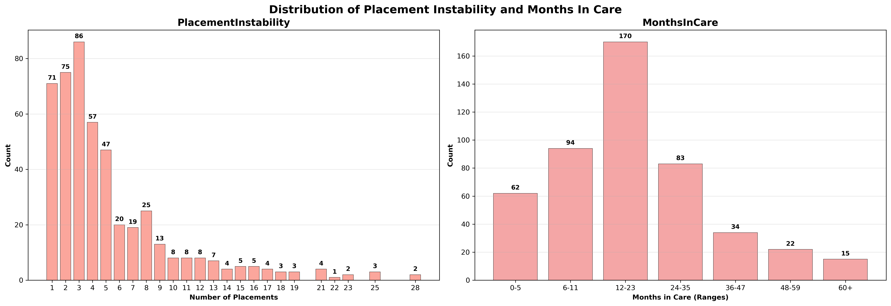
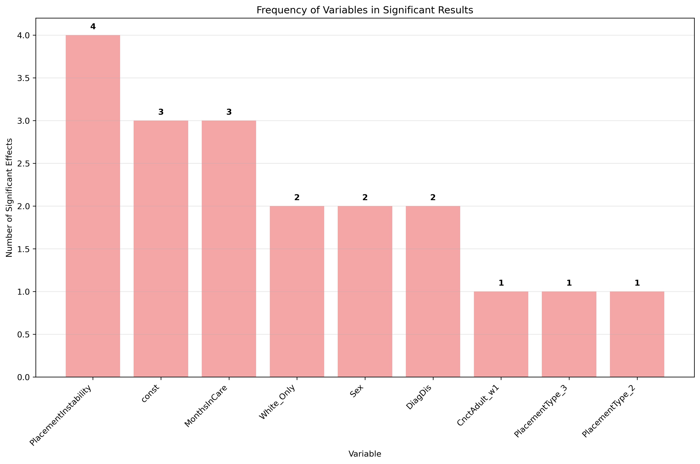

# NYTD Modeling: Visual Data Report

This report summarizes the key analyses, results, and visualizations from the notebook `all_visual_data.ipynb`. It covers significant predictors, outcome distributions, descriptive statistics, and model insights for the NYTD dataset.

---

## Table of Contents
1. [Introduction](#introduction)
2. [Data Overview](#data-overview)
3. [Significant Variables From Paper](#all-significant-variables-from-paper)
4. [ALL Significant Variables](#all-significant-variables)
5. [Significant Model Results](#significant-model-results)
6. [Descriptive Statistics](#descriptive-statistics)
7. [Outcome Distributions](#outcome-distributions)
8. [Predictor Distributions](#predictor-distributions)
9. [Placement and Care Variables](#placement-and-care-variables)
10. [Variable Importance & Effect Sizes](#variable-importance--effect-sizes)
11. [Summary Dashboard](#summary-dashboard)
12. [Appendix: Model Details](#appendix-model-details)
13. [Appendix: Charts and Visualizations](#appendix-charts-and-visualizations)
14. [Appendix: Data Breakdown](#appendix-data-breakdown)

---

## Introduction

This report presents a comprehensive analysis of NYTD data, focusing on outcomes for youth in foster care. The analyses include:
- Identification of significant predictors for key outcomes
- Visualization of outcome and predictor distributions
- Summary statistics and data quality assessments
- Model effect sizes and variable importance

---

## Data Overview

- **Main dataset:** `wave_service_afcars_final.csv`
- **Significant model results:** `significant_model_results.csv`

- **Outcomes analyzed** (_all outcome variables are post fostercare (ages 19-21)_)
    - Pursuing higher education or full-time employment [Connected_Youth]
    - Having a supportive adult connection [CnctAdult_w23]
    - Experiencing homelessness [Homeless_w23]
    - Receiving a substance abuse referral [SubAbuse_w23]
    - Being incarcerated [Incarc_w23]
    - Having children without being married [Children_NoMarriage_w23]
- **Predictor groups** 
    - Core demographics [Sex]
    - Disability [DiagDis]
    - Removal Reason [RR_neglect, RR_abuse, RR_other]
    - Placement [PlacementType, PlacementInstability, MonthsInCare]
    - Early Indicators [SubAbuse_w1, CnctAdult_w1]

---

## Significant Variables From Paper

### Key Findings Summary

Our analysis identified **19 significant relationships** between foster care experiences and young adult outcomes. Here are the most important findings in simple terms:

#### 🎯 **Most Important Predictors**
- **Placement instability** (frequent moves between homes) appears in 4 different outcomes - the most frequent predictor
- **Gender (Sex)** strongly affects incarceration rates - females are much less likely to be incarcerated
- **Time in care** (months spent in foster care) affects multiple outcomes
- **Having a disability** increases risk for homelessness and substance abuse

#### 📊 **Key Outcome Patterns**

**Education & Employment Success:**
- Youth with more stable placements are more likely to be connected to education or employment
- Females and those with longer time in care tend to do better
- Having a disability makes this harder to achieve

**Criminal Justice Involvement:**
- Females are significantly less likely to be incarcerated
- Youth in group homes or other placements (vs. foster homes) have higher incarceration rates
- More placement moves increase incarceration risk

**Housing Stability:**
- Youth with disabilities are more likely to experience homelessness
- More placement instability increases homelessness risk

**Substance Use:**
- White youth and those with more placement moves are more likely to receive substance abuse referrals
- Longer time in care slightly reduces this risk

**Adult Connections:**
- Youth who had supportive adults while in care are much more likely to maintain these connections as young adults

#### 💡 **What This Means**
These findings suggest that **placement stability** and **early supportive relationships** are crucial for positive outcomes. Youth with disabilities need extra support, and the type of placement (foster home vs. group home) matters significantly for future success.

---
## ALL Significant Variables

### Key Findings Summary

Our expanded analysis identified **17 additional significant relationships** across a broader range of outcomes. Here are the most important findings in simple terms:

#### 🎯 **Most Important New Predictors**
- **Service_Count** (number of services received) appears in 3 different outcomes - a strong new predictor
- **DiagDis** (disability) appears in 4 outcomes - confirming its importance across multiple domains
- **Sex** continues to show strong effects, especially for public assistance and education
- **RR_other** (removal reasons other than abuse/neglect) affects homelessness and eligibility

#### 📊 **Key Outcome Patterns**

**Education & Employment Success:**
- Youth with disabilities are less likely to be connected to foster care services
- More services received increases educational aid access
- Females are more likely to receive public food assistance
- Females are more likely to have high school diploma or GED

**Current Enrollment & Services:**
- Youth with disabilities are less likely to be currently enrolled
- More services received increases current enrollment likelihood
- Service access is crucial for maintaining educational engagement

**Housing & Basic Needs:**
- Youth with disabilities are more likely to experience homelessness
- Youth removed for reasons other than abuse/neglect are less likely to be homeless
- Females are more likely to receive public food assistance

**Health & Eligibility:**
- Youth with disabilities are more likely to have other health insurance
- Youth with disabilities are more likely to be eligible for services at age 19
- Youth removed for other reasons are less likely to be eligible
- Similar patterns exist for survey response rates

#### 💡 **What This Means**
These findings highlight the critical importance of **service access** and **disability support** for youth in foster care. Youth with disabilities face multiple barriers but also have greater service needs. Gender differences persist across multiple domains, and the reasons for removal from home continue to matter for long-term outcomes. **Service provision** emerges as a key protective factor for educational and employment success.

## Significant Model Results

### Key Findings
- **Total significant effects found:** 19
- **Outcomes analyzed:** 6
- **Unique variables with significant effects:** 9

### Strongest Effects (by absolute coefficient)

#### 🎯 **Largest Effect Sizes**
The strongest effects in our analysis show which factors have the biggest impact on outcomes:

**1. Substance Abuse Risk (SubAbuse_w23):** -3.33 units
- **What it means:** There's a strong baseline reduction in substance abuse referrals
- **Impact:** This suggests that most youth don't receive substance abuse referrals

**2. Having Children Without Marriage (Children_NoMarriage_w23):** -2.44 units  
- **What it means:** There's a strong baseline reduction in having children while unmarried
- **Impact:** Most youth don't have children before marriage

**3. Adult Connections (CnctAdult_w23):** +2.40 units
- **What it means:** There's a strong baseline increase in having supportive adult connections
- **Impact:** Most youth maintain connections with supportive adults

**4. Early Adult Connections (CnctAdult_w1):** +1.34 units
- **What it means:** Youth who had supportive adults while in care are much more likely to maintain these connections
- **Impact:** Early supportive relationships have lasting positive effects

**5. Gender and Incarceration (Sex → Incarc_w23):** -1.16 units
- **What it means:** Females are much less likely to be incarcerated than males
- **Impact:** Gender has a very strong protective effect against incarceration

#### 💡 **Key Insight**
The strongest effects are mostly **baseline effects** (constants) and **gender differences**, suggesting that fundamental demographic factors and early experiences have the biggest impact on outcomes.

### Most Significant Effects (by p-value)

#### 🎯 **Most Statistically Reliable Findings**
These effects have the strongest statistical evidence (lowest p-values), meaning we're most confident these relationships are real:

**1. Gender and Incarceration (Sex → Incarc_w23):** p = 0.000004
- **What it means:** We're extremely confident that females are less likely to be incarcerated
- **Confidence:** 99.9996% confident this effect is real

**2. Group Home Placement and Incarceration (PlacementType_3 → Incarc_w23):** p = 0.000104
- **What it means:** We're very confident that youth in group homes have higher incarceration rates
- **Confidence:** 99.99% confident this effect is real

**3. Other Placement Types and Incarceration (PlacementType_2 → Incarc_w23):** p = 0.000730
- **What it means:** We're very confident that other placement types also increase incarceration risk
- **Confidence:** 99.93% confident this effect is real

**4. Placement Instability and Incarceration (PlacementInstability → Incarc_w23):** p = 0.001085
- **What it means:** We're very confident that more placement moves increase incarceration risk
- **Confidence:** 99.89% confident this effect is real

**5. Time in Care and Incarceration (MonthsInCare → Incarc_w23):** p = 0.001542
- **What it means:** We're very confident that longer time in care reduces incarceration risk
- **Confidence:** 99.85% confident this effect is real

#### 💡 **Key Insight**
All the most statistically significant effects relate to **incarceration risk**, with **gender** and **placement factors** being the most reliable predictors. This suggests that criminal justice involvement is the outcome we can predict most confidently.

### Effects by Outcome
- **Children_NoMarriage_w23:** 2 significant variables (const, White_Only)
- **CnctAdult_w23:** 2 significant variables (CnctAdult_w1, const)
- **Connected_Youth:** 4 significant variables
- **Homeless_w23:** 2 significant variables
- **Incarc_w23:** 5 significant variables
- **SubAbuse_w23:** 4 significant variables

---

## Descriptive Statistics

## Outcome Distributions

### Frequency Breakdown

#### 📊 **Outcome Distribution Summary**
Here's how our youth fared across the key outcomes:

**🏠 Housing & Family Outcomes:**
- **Having Children Without Marriage:** 22.4% of youth (159 out of 709) had children while unmarried
- **Experiencing Homelessness:** 29.3% of youth (211 out of 719) experienced homelessness

**🎓 Education & Employment:**
- **Connected to Education/Employment:** 64.8% of youth (464 out of 716) were pursuing education or full-time employment
- **Supportive Adult Connections:** 94.3% of youth (678 out of 719) maintained connections with supportive adults

**⚖️ Criminal Justice & Health:**
- **Incarceration:** 35.7% of youth (256 out of 718) were incarcerated
- **Substance Abuse Referrals:** 18.5% of youth (133 out of 717) received substance abuse referrals

#### 💡 **Key Insights**
- **Most youth maintain adult connections** (94.3%) - a positive finding
- **Nearly two-thirds are connected to education/employment** (64.8%)
- **Significant challenges remain:** About 1 in 3 youth experience incarceration or homelessness
- **Data quality is excellent:** Missing data is very low (under 2% for all outcomes)

### Summary Statistics for All Outcomes

#### 📈 **Statistical Overview**
The data shows the overall patterns and quality of our outcome measures:

**📊 Data Quality:**
- **Sample sizes range from 709-719 youth** across different outcomes
- **Missing data is very low** (0.14% to 1.53% missing)
- **Data completeness is excellent** (98.5% to 99.9% complete)

**📋 Outcome Patterns:**
- **Adult Connections (94.3%):** Nearly all youth maintain supportive relationships
- **Education/Employment (64.8%):** Most youth are connected to positive activities
- **Incarceration (35.7%):** About 1 in 3 youth experience criminal justice involvement
- **Homelessness (29.3%):** Nearly 1 in 3 youth experience housing instability
- **Children Without Marriage (22.4%):** About 1 in 5 youth have children while unmarried
- **Substance Abuse (18.5%):** About 1 in 6 youth receive substance abuse referrals

#### 💡 **What This Means**
The data shows both **strengths and challenges** for youth aging out of foster care. While most maintain supportive relationships and many stay connected to education/employment, significant portions still face serious challenges with housing, criminal justice involvement, and early parenthood.

---

## Predictor Distributions

### Predictor Variables
- Sex
- White_Only
- Race_other
- DiagDis (Diagnosed Disability)
- RR_neglect (Removal Reason: Neglect)
- RR_abuse (Removal Reason: Abuse)
- RR_other (Removal Reason: Other)
- PlacementType
    * Type 1: Foster Home
    * Type 2: Group Home
    * Type 3: Other 
- SubAbuse_w1 (Substance abuse referral while in foster care)
- CnctAdult_w1 (Connected adult while in foster care)

### Predictor Groups
- **Core Demographics:** Sex, White_Only, race_other
- **Disability:** DiagDis
- **Removal Reason:** RR_neglect, RR_abuse, RR_other
- **Placement:** PlacementType, PlacementInstability, MonthsInCare
- **Early Indicators:** SubAbuse_w1, CnctAdult_w1

---

### Key Insights
- Most youth spend 1-2 years in care (12-23 months)
- Placement instability varies widely, with most youth experiencing 1-5 placements
- Both variables show right-skewed distributions
- Moderate positive correlation between months in care and placement instability

---

## Variable Importance & Effect Sizes

### Variable Importance Table

#### 🎯 **Most Important Predictors**
Based on how frequently variables appear across different outcome models:

**🥇 Top Predictors (by frequency):**
- **Placement Instability (4 times):** The most important predictor, affecting 4 different outcomes
- **Months in Care (3 times):** Time spent in foster care affects 3 different outcomes
- **Gender/Sex (2 times):** Appears in 2 different outcome models
- **White Race (2 times):** Appears in 2 different outcome models
- **Disability Status (2 times):** Appears in 2 different outcome models

**🥈 Strong but Specific Predictors:**
- **Early Adult Connections (1 time):** Very strong effect but only on one outcome
- **Group Home Placement (1 time):** Strong effect but specific to incarceration
- **Other Placement Types (1 time):** Strong effect but specific to incarceration

#### 📊 **Effect Strength Analysis**

**Strongest Average Effects:**
- **Early Adult Connections:** +1.34 average effect (very strong positive)
- **Group Home Placement:** +1.12 average effect (strong positive)
- **Other Placement Types:** +1.07 average effect (strong positive)
- **Gender:** -0.32 average effect (moderate negative)
- **White Race:** +0.23 average effect (moderate positive)

**Most Reliable Predictors (by p-value):**
- **Group Home Placement:** p = 0.0001 (extremely reliable)
- **Other Placement Types:** p = 0.0007 (very reliable)
- **Gender:** p = 0.0111 (reliable)
- **White Race:** p = 0.0156 (reliable)
- **Disability:** p = 0.0172 (reliable)

#### 💡 **Key Insights**
- **Placement instability is the most universal predictor** - it affects the most outcomes
- **Time in care matters across multiple domains** - longer stays affect multiple outcomes
- **Demographic factors (gender, race) have moderate but consistent effects**
- **Placement type has strong but specific effects** - mainly on criminal justice outcomes
- **Early supportive relationships have the strongest positive effect** but only on one outcome

---

## Summary Dashboard

### Key Metrics
- **Total Significant Effects:** 19
- **Positive Effects:** 10
- **Negative Effects:** 9
- **Outcomes Analyzed:** 6
- **Unique Variables:** 9

### Effect Direction Distribution
- **Positive Effects:** 52.6% (10 out of 19)
- **Negative Effects:** 47.4% (9 out of 19)

---
## Appendix: Tables

### Significant Variables From Paper Full Table

| Outcome                | Variable            | Coefficient | P-Value   | CI Lower | CI Upper |
|------------------------|--------------------|-------------|-----------|----------|----------|
| Children_NoMarriage_w23| const              | -2.44       | 0.0104    | -4.30    | -0.57    |
| Children_NoMarriage_w23| White_Only         | -0.54       | 0.0268    | -1.02    | -0.06    |
| CnctAdult_w23          | CnctAdult_w1       | 1.34        | 0.0324    | 0.11     | 2.56     |
| CnctAdult_w23          | const              | 2.40        | 0.0481    | 0.02     | 4.78     |
| Connected_Youth        | PlacementInstability| -0.07      | 0.0082    | -0.13    | -0.02    |
| Connected_Youth        | Sex                | 0.52        | 0.0221    | 0.07     | 0.96     |
| Connected_Youth        | DiagDis            | -0.49       | 0.0228    | -0.91    | -0.07    |
| Connected_Youth        | MonthsInCare       | 0.02        | 0.0312    | 0.00     | 0.04     |
| Homeless_w23           | DiagDis            | 0.55        | 0.0116    | 0.12     | 0.97     |
| Homeless_w23           | PlacementInstability| 0.06      | 0.0433    | 0.00     | 0.11     |
| Incarc_w23             | Sex                | -1.16       | 0.0000    | -1.65    | -0.66    |
| Incarc_w23             | PlacementType_1.0  | 1.12        | 0.0001    | 0.55     | 1.68     |
| Incarc_w23             | PlacementType_0.5  | 1.07        | 0.0007    | 0.45     | 1.70     |
| Incarc_w23             | PlacementInstability| 0.10      | 0.0011    | 0.04     | 0.16     |
| Incarc_w23             | MonthsInCare       | -0.03       | 0.0015    | -0.05    | -0.01    |
| SubAbuse_w23           | const              | -3.33       | 0.0030    | -5.53    | -1.13    |
| SubAbuse_w23           | White_Only         | 1.01        | 0.0045    | 0.31     | 1.70     |
| SubAbuse_w23           | PlacementInstability| 0.09      | 0.0108    | 0.02     | 0.16     |
| SubAbuse_w23           | MonthsInCare       | -0.03       | 0.0109    | -0.06    | -0.01    |

### ALL Significant Variables Full Table

| Outcome                | Variable            | Coefficient | P-Value   | CI Lower | CI Upper |
|------------------------|--------------------|-------------|-----------|----------|----------|
| OutcmFCS_w23           | DiagDis            | -1.16       | 0.0010    | -1.85    | -0.47    |
| OutcmFCS_w23           | Service_Count      | 0.83        | 0.0023    | 0.30     | 1.37     |
| EducAid_w23            | Service_Count      | 0.54        | 0.0206    | 0.08     | 0.99     |
| PubFoodAs_w23          | const              | -3.57       | 0.0124    | -6.36    | -0.77    |
| PubFoodAs_w23          | Sex                | 1.77        | 0.0002    | 0.84     | 2.71     |
| CurrenRoll_w23         | DiagDis            | -0.92       | 0.0083    | -1.60    | -0.24    |
| CurrenRoll_w23         | Service_Count      | 0.69        | 0.0130    | 0.15     | 1.24     |
| Homeless_w23           | DiagDis            | 0.85        | 0.0254    | 0.10     | 1.60     |
| Homeless_w23           | RR_other           | -1.72       | 0.0162    | -3.13    | -0.32    |
| OthrHlthIn_w23         | const              | -3.55       | 0.0298    | -6.76    | -0.35    |
| Elig19_w23             | const              | 3.78        | 0.0256    | 0.46     | 7.10     |
| Elig19_w23             | DiagDis            | 1.34        | 0.0048    | 0.41     | 2.27     |
| Elig19_w23             | RR_other           | -2.26       | 0.0484    | -4.51    | -0.02    |
| Responded_w23          | const              | 3.78        | 0.0256    | 0.46     | 7.10     |
| Responded_w23          | DiagDis            | 1.34        | 0.0048    | 0.41     | 2.27     |
| Responded_w23          | RR_other           | -2.26       | 0.0484    | -4.51    | -0.02    |
| HS_or_GED_w23          | Sex                | 0.75        | 0.0284    | 0.08     | 1.41     |

### Strongest Effects (by absolute coefficient) Full Table

| Variable         | Outcome                | Coefficient | p-value  | Effect Description                       |
|------------------|------------------------|-------------|----------|------------------------------------------|
| const            | SubAbuse_w23           | -3.330      | 0.0030   | Decreases SubAbuse_w23 by 3.33 units     |
| const            | Children_NoMarriage_w23| -2.439      | 0.0104   | Decreases Children_NoMarriage_w23 by 2.44|
| const            | CnctAdult_w23          | 2.401       | 0.0481   | Increases CnctAdult_w23 by 2.40 units    |
| CnctAdult_w1     | CnctAdult_w23          | 1.336       | 0.0324   | Increases CnctAdult_w23 by 1.34 units    |
| Sex              | Incarc_w23             | -1.157      | 0.0000   | Decreases Incarc_w23 by 1.16 units       |

### Most Significant Effects (by p-value) Full Table

| Variable         | Outcome        | Coefficient | 95% CI           | p-value   |
|------------------|---------------|-------------|------------------|-----------|
| Sex              | Incarc_w23    | -1.157      | [-1.650, -0.664] | 0.000004  |
| PlacementType_3  | Incarc_w23    | 1.116       | [0.553, 1.680]   | 0.000104  |
| PlacementType_2  | Incarc_w23    | 1.074       | [0.451, 1.697]   | 0.000730  |
| PlacementInstability | Incarc_w23 | 0.098       | [0.039, 0.156]   | 0.001085  |
| MonthsInCare     | Incarc_w23    | -0.031      | [-0.051, -0.012] | 0.001542  |

### Frequency Breakdown Full Table

| Outcome                | 0 (No) | 1 (Yes) | Valid N | Missing |
|------------------------|--------|---------|---------|---------|
| Children_NoMarriage_w23| 550    | 159     | 709     | 11      |
| CnctAdult_w23          | 41     | 678     | 719     | 1       |
| Connected_Youth        | 252    | 464     | 716     | 4       |
| Homeless_w23           | 508    | 211     | 719     | 1       |
| Incarc_w23             | 462    | 256     | 718     | 2       |
| SubAbuse_w23           | 584    | 133     | 717     | 3       |

### Summary Statistics for All Outcomes Full Table

| Outcome                | count  | mean   | std    | missing_pct |
|------------------------|--------|--------|--------|-------------|
| Children_NoMarriage_w23| 709.0  | 0.224  | 0.417  | 1.53        |
| CnctAdult_w23          | 719.0  | 0.943  | 0.232  | 0.14        |
| Connected_Youth        | 716.0  | 0.648  | 0.478  | 0.56        |
| Homeless_w23           | 719.0  | 0.293  | 0.456  | 0.14        |
| Incarc_w23             | 718.0  | 0.357  | 0.479  | 0.28        |
| SubAbuse_w23           | 717.0  | 0.185  | 0.389  | 0.42        |

### Variable Importance Table Full Table

| Variable             | Frequency | Mean Coeff | Mean Abs Coeff | Mean p-value |
|----------------------|-----------|------------|---------------|--------------|
| const                | 3         | -1.12      | 2.72          | 0.0205       |
| CnctAdult_w1         | 1         | 1.34       | 1.34          | 0.0324       |
| PlacementType_3      | 1         | 1.12       | 1.12          | 0.0001       |
| PlacementType_2      | 1         | 1.07       | 1.07          | 0.0007       |
| Sex                  | 2         | -0.32      | 0.84          | 0.0111       |
| White_Only           | 2         | 0.23       | 0.77          | 0.0156       |
| DiagDis              | 2         | 0.03       | 0.52          | 0.0172       |
| PlacementInstability | 4         | 0.04       | 0.08          | 0.0159       |
| MonthsInCare         | 3         | -0.02      | 0.03          | 0.0146       |

## Appendix: Model Details

- **Modeling approach:** Logistic regression for each outcome
- **Variance Inflation Factors (VIF):** Checked for multicollinearity
- **Significance threshold:** p < 0.05

---

## Appendix: Charts and Visualizations

### Forest Plots by Outcome

### Outcome Distribution Bar Charts

### Predictor Distribution Bar Charts

### Placement and Care Distribution

### Coefficient Magnitude Plot

### Variable Frequency Plot

### Summary Dashboard

---
 ## Appendix: Data Breakdown 
**Data Definition:**
- **Valid Count:** Number of non-missing observations
- **Missing Count:** Number of missing observations
- **Completeness:** Percentage of complete data (Valid Count / Total Count * 100)
- **Zero Values (%):** Percentage of observations with value 0
- **Mode Count:** Number of times the most frequent value appears
- **Mode (%):** Percentage of observations with the modal value
- **Quality Flags:** Data quality indicators (Good, Many Zeros, Low Completeness, High Outliers)

### Predictor Statistics

| Variable | Valid Count | Missing Count | Completeness (%) | Mean | Median | Std Dev | Unique Values | Zero Values (%) | Mode | Mode Count | Mode (%) | Quality Flags |
|----------|-------------|---------------|------------------|------|--------|---------|---------------|----------------|------|------------|----------|---------------|
| Sex | 720 | 0 | 100.0% | 1.429 | 1.0 | 0.495 | 2 | 0.0% | 1.0 | 411 | 57.1% | Good |
| White_Only | 720 | 0 | 100.0% | 0.617 | 1.0 | 0.487 | 2 | 38.3% | 1.0 | 444 | 61.7% | Many Zeros |
| Black_Only | 720 | 0 | 100.0% | 0.0 | 0.0 | 0.0 | 1 | 100.0% | 0.0 | 720 | 100.0% | Many Zeros |
| race_other | 720 | 0 | 100.0% | 0.047 | 0.0 | 0.212 | 2 | 95.3% | 0.0 | 686 | 95.3% | Many Zeros |
| DiagDis | 470 | 250 | 65.3% | 0.494 | 0.0 | 0.5 | 2 | 50.6% | 0.0 | 238 | 50.6% | Low Completeness; Many Zeros |
| PlacementType | 480 | 240 | 66.7% | 1.975 | 2.0 | 0.888 | 3 | 0.0% | 1.0 | 195 | 40.6% | Low Completeness |
| PlacementInstability | 480 | 240 | 66.7% | 5.292 | 4.0 | 4.867 | 24 | 0.0% | 3.0 | 86 | 17.9% | Low Completeness; High Outliers |
| MonthsInCare | 480 | 240 | 66.7% | 20.99 | 16.444 | 16.914 | 390 | 0.0% | 17.774 | 4 | 0.8% | Low Completeness |
| Service_Count | 245 | 475 | 34.0% | 0.449 | 0.0 | 1.291 | 8 | 73.9% | 0.0 | 181 | 73.9% | Low Completeness; Many Zeros |
| RR_neglect | 480 | 240 | 66.7% | 0.171 | 0.0 | 0.377 | 2 | 82.9% | 0.0 | 398 | 82.9% | Low Completeness; High Outliers; Many Zeros |
| RR_abuse | 480 | 240 | 66.7% | 0.121 | 0.0 | 0.326 | 2 | 87.9% | 0.0 | 422 | 87.9% | Low Completeness; High Outliers; Many Zeros |
| RR_other | 480 | 240 | 66.7% | 0.86 | 1.0 | 0.347 | 2 | 14.0% | 1.0 | 413 | 86.0% | Low Completeness; High Outliers |
| SubAbuse_w1 | 718 | 2 | 99.7% | 0.377 | 0.0 | 0.485 | 2 | 62.3% | 0.0 | 447 | 62.3% | Many Zeros |
| CnctAdult_w1 | 719 | 1 | 99.9% | 0.953 | 1.0 | 0.212 | 2 | 4.7% | 1.0 | 685 | 95.3% | Good |

---

### Outcome Statistics

| Variable | Valid Count | Missing Count | Completeness (%) | Mean | Median | Std Dev | Unique Values | Zero Values (%) | Mode | Mode Count | Mode (%) | Quality Flags |
|----------|-------------|---------------|------------------|------|--------|---------|---------------|----------------|------|------------|----------|---------------|
| Children_NoMarriage_w23 | 709 | 11 | 98.5% | 0.224 | 0.0 | 0.417 | 2 | 77.6% | 0.0 | 550 | 77.6% | High Outliers; Many Zeros |
| CnctAdult_w23 | 719 | 1 | 99.9% | 0.943 | 1.0 | 0.232 | 2 | 5.7% | 1.0 | 678 | 94.3% | High Outliers |
| Connected_Youth | 716 | 4 | 99.4% | 0.648 | 1.0 | 0.478 | 2 | 35.2% | 1.0 | 464 | 64.8% | Many Zeros |
| Homeless_w23 | 719 | 1 | 99.9% | 0.293 | 0.0 | 0.456 | 2 | 70.7% | 0.0 | 508 | 70.7% | Many Zeros |
| Incarc_w23 | 718 | 2 | 99.7% | 0.357 | 0.0 | 0.479 | 2 | 64.3% | 0.0 | 462 | 64.3% | Many Zeros |
| SubAbuse_w23 | 717 | 3 | 99.6% | 0.185 | 0.0 | 0.389 | 2 | 81.5% | 0.0 | 584 | 81.5% | High Outliers; Many Zeros |

*Report generated from `all_visual_data.ipynb`.*